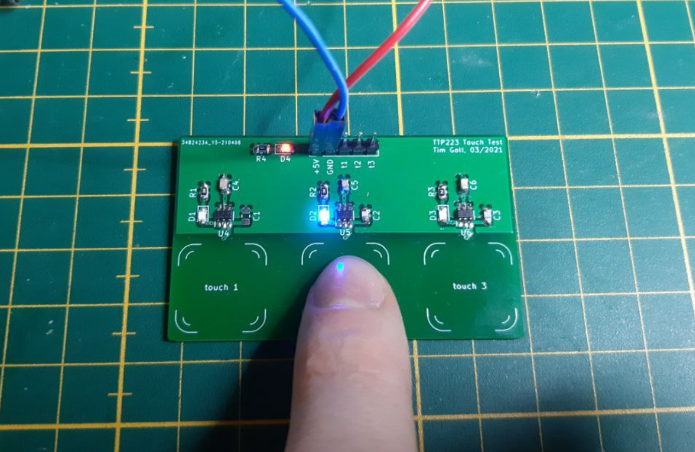

# Touch Pad PCB Test

FOr an upcoming project I wanted to test how to impement PCB touch pads. The easiest solution that I could find was to use the `TTP223` IC. All in all the design was pretty easy and straightforward.

There were mainly two three things to experiment:

* does my custom touchpad footprint work?
* is the minimal spacing between the pads enough?
* what size should the capacitor be?

The first two questions could be answered easily, the last one took some further investigation. The datasheet says that the capacitor should be in the range between `0` and `50pF`. Some testing reaveled that `22pF` seems to be the optimum for my 1.6mm thick PCB. `0pF` is way too low. It triggers a change even if I'm still a few centimeters away from the pad. This could work as a general proximity sensor, but not as a touchpad. `50pF` on the other hand was too much. You had to press quite strong with your finger in the center of the pad in order to register any contact at all.

_(testing the touchpads - it works!)_
